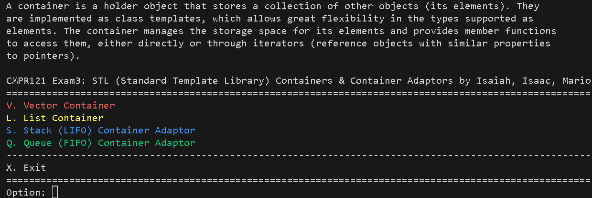

# Rational Number & Custom Data Structures Toolkit

[](https://en.cppreference.com/w/cpp/17)
[](https://cmake.org/)

A high-performance C++ mathematical and data-structure application implementing an exact-precision rational arithmetic class, custom memory-managed container structures (dynamic vectors, stacks, and queues), and a robust terminal interface.

---

## Key Features

- **Exact Fractional Arithmetic**: Encapsulates rational fractions (numerator / denominator) with automatic reduction to lowest terms via the Euclidean GCD algorithm, avoiding floating-point rounding errors.
- **Full Operator Overloading**: Supports relational (`==`, `<`), and stream I/O (`<<`) operators.
- **Dynamic Container Implementations**: Demonstrates manual memory management, dynamic resizing, and standard abstract data type (ADT) behaviors.
  - **Vector**: Insertion, deletion, search, and dynamic resizing.
  - **Stack**: LIFO adapter (push, pop, top, empty check).
  - **Queue**: FIFO adapter (enqueue, dequeue, front, empty check).
- **Hardened CLI Input**: Type-safe input wrappers (`input.h`) that sanitize user input, validate bounds, and guard against terminal stream crashes.
- **Cross-Platform CMake Build**: Decoupled from Windows-specific IDE files (`.sln`, `.vcxproj`) to build cleanly on Linux, macOS, and Windows.

---

## Project Structure

```text
├── CMakeLists.txt      # Cross-platform build configuration
├── .gitignore          # Ignores build artifacts, object files, and IDE cache
├── input.h             # CLI input validation and stream sanitization
├── Rational.h          # Rational number ADT definition and operator interfaces
├── main.cpp            # Application lifecycle, interactive menus, and test suites
└── README.md           # Documentation
```

## Build and Run

### Prerequisites

- Compiler: GCC/G++9+, Clang 10+, or MSVC 2019+ (C++17 support)
- Build System: CMake 3.15+

## Linux/WSL/macOS

``` text
Bash

# Configure the build
cmake -B build

# Compile
cmake --build build

# Run
./build/RationalApp
```

## Windows (Powershell/Command Prompt)

``` text
# PowerShell
cmake -B build
cmake --build build --config Release
.\build\Release\RationalApp.exe
```

## Interactive Menu Overview



## Technical Specifications

- Language Standard: ISO C++17
- Compiler Flags: `-Wall` `-Wextra` `Wpedantic` (GCC/Clang), `/W4` (MSVC)
- Memory Safety: No unmanaged raw pointer leaks during container expansion, element removal, or reassignment.

## Authors

[](https://github.com/IsaiahAquino2/)
[](https://www.linkedin.com/in/isaiah-aquino-2a95053a7/)
